# IDS706-Intro-DB-Assignment

### This project explores the University Rankings database to execute simple SQL queries. The goal here is to showcase how SQL queries and CRUD functions work.

## Repository Structure
```
IDS706-INTRO-DB-ASSIGNMENT/
├── crud_queries.sql            # CRUD operation queries
├── my_queries.sql              # Self-made analysis queries
├── README.md                   # Project documentation
├── university_database.db      # SQLite database file
└── screenshots/                # Saved screenshots
    ├── command_line/           # Terminal-based queries
    │   ├── crud_delete.png         # DELETE example
    │   ├── crud_insert.png         # INSERT example
    │   ├── crud_japan.png          # CRUD Update Japan
    │   ├── crud_oxford.png         # CRUD Update Oxford
    │   ├── q3_1.png                # Question 3.1 output
    │   ├── q3_2.png                # Question 3.2 output
    │   ├── q3_3.png                # Question 3.3 output
    │   ├── q3_4.png                # Question 3.4 output
    │   ├── q3_5.png                # Question 3.5 output
    │   └── q3_6.png                # Question 3.6 output
    └── DBeaver/                # GUI-based queries
        ├── analyze_table_info.png # Table analysis
        ├── connect_db_1.png       # DB connection
        ├── crud_delete.png        # DELETE example
        ├── crud_insert.png        # INSERT example
        ├── crud_japan.png         # CRUD Update Japan
        ├── crud_oxford.png        # CRUD Update Oxford
        ├── q3_1.png               # Question 3.1 output
        ├── q3_2.png               # Question 3.2 output
        ├── q3_3.png               # Question 3.3 output
        ├── q3_4.png               # Question 3.4 output
        ├── q3_5.png               # Question 3.5 output
        └── q3_6.png               # Question 3.6 output
```


## Setup Instructions
- This repository contains `.sql` files, however, it does not provide the necessary environment to execcute these files (the instructions did not require us to create an environment).
- In order to execute the SQL queries, please clone this repository and use either SQLite on the command line or an IDE like DBeaver.
- The database required is included in this repository as the `university_database.db`.

## Explanation of Queries

### Exploratory Queries:

My approach for coming up with these queries was to take a look at the data and ask questions that would reveal the most important information about this dataset.

After inspecting the structure of the dataset using the `PRAGMA table_info()` command, I came up with some questions and answered them using SQL queries. Each of them is explained below along with results.

0. Connect to the database in either command line or an environment (I used both the command line and DBeaver).
- For command line, we type the command: `sqlite3 university_database.db`.
- For DBeaver, we connect to the database by putting filepath into the Connection widget.

Results:
- 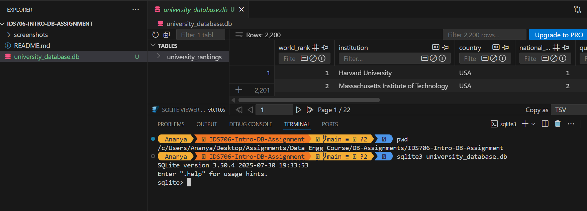
- 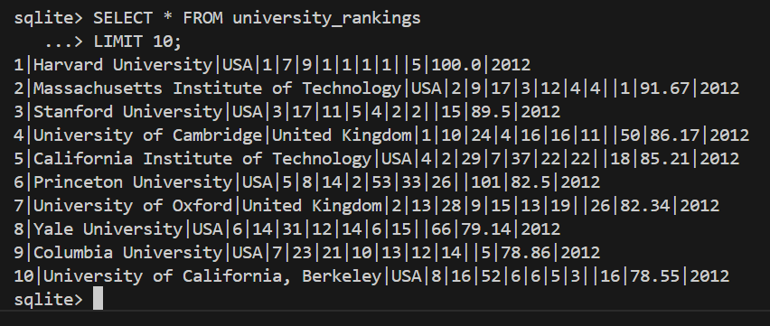
- 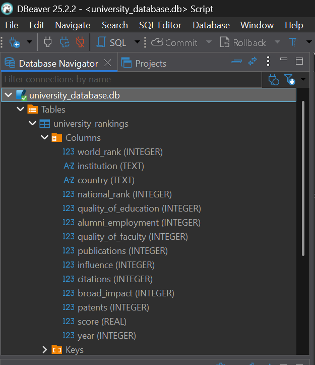

====================================================================================================
1. See data types using table_info().

Query:
```sql
PRAGMA table_info(university_rankings);
```
Results:
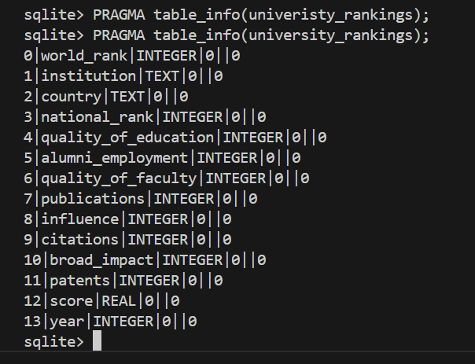

2. Come up with questions about the data, and use queries to answer them.
- I came up with the following questions:

3. Queries for Self-formed EDA Questions:

##### 3.1. How many years of rankings are shown in the data?

```sql
SELECT year, COUNT(year)
FROM university_rankings
GROUP BY year;
```
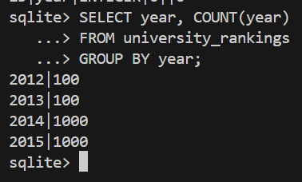


##### 3.2. How many countries appear in this table? 
```sql
SELECT COUNT(DISTINCT country) FROM university_rankings;
```
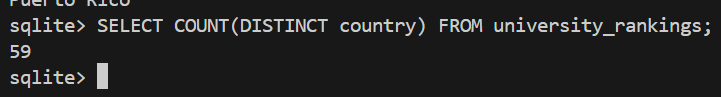


##### 3.3. How does the set of countries represented differ across years?
```sql
SELECT year, COUNT(DISTINCT country) FROM university_rankings
GROUP BY year;
```
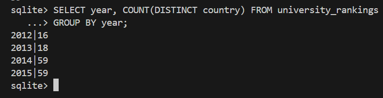

##### 3.4. Which institutions appear in the top 5 across various years?
```sql
SELECT year, institution FROM university_rankings
WHERE world_rank <= 5;
```
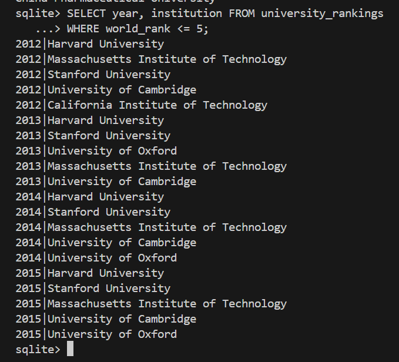

##### 3.5. Check summary statistics of quality_of_education
```sql
SELECT AVG(quality_of_education) AS avg_qual,
SUM(quality_of_education) AS sum_qual,
MIN(quality_of_education) AS min_qual,
MAX(quality_of_education) AS mix_qual
FROM university_rankings;
```
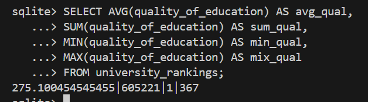

##### 3.6. How do these stats differ across years?
```sql
SELECT year, AVG(quality_of_education) AS avg_qual, 
SUM(quality_of_education) AS sum_qual,
MIN(quality_of_education) AS min_qual,
MAX(quality_of_education) AS mix_qual
FROM university_rankings 
GROUP BY year;
```
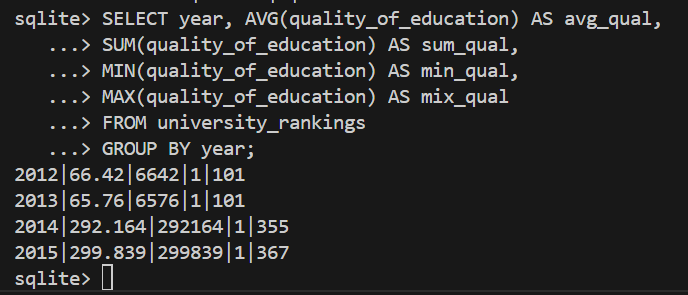

### Observations from Exploratory Queries:
1. A documentation for this table would be super helpful to the database analyst. It'd help us understand the difference between variables like score and influence. 
2. Beyond SQLite, Python would be a great tool to see correlations and data visualization among these variables.


### CRUD Queries Provided in the Instructions:
##### 1. Insert Duke Tech into the data
```sql
INSERT INTO university_rankings(world_rank, institution, country, score)
VALUES (350, 'Duke Tech', 'USA', 60.5);
SELECT * FROM university_rankings WHERE institution = 'Duke Tech';
```
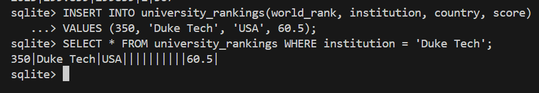

##### 2. How many universities from Japan show up in the global top 200 in 2013?
```sql
SELECT COUNT(institution)
FROM university_rankings 
WHERE world_rank <= 20 AND country = 'Japan';
```
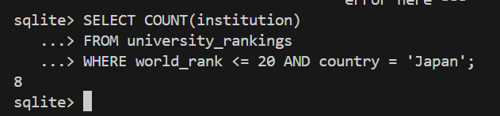

##### 3. Increase Oxford's score by +1.2 points
```sql
UPDATE university_rankings
SET score = score + 1.2
WHERE year = 2014 AND institution = 'University of Oxford';
SELECT * FROM university_rankings
WHERE year = 2014 AND institution = 'University of Oxford';
```
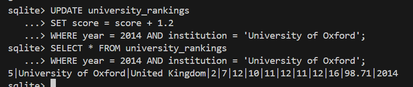

##### 4. Delete universities with a score below 45 in 2015
```sql
DELETE FROM university_rankings
WHERE year = 2015 AND world_rank > 45;
SELECT COUNT(*) FROM university_rankings;
```
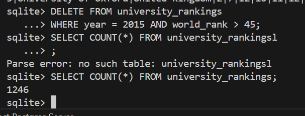

### Note:
Please find screenshots of DBeaver executions here: [DBeaver_subfolder](/screenshots/DBeaver/). They were not included in the README for easier readability. Further, **command line inputs are reproducible** across more environments, as a DBeaver installation won't be required. **So, they were prioritized** in the README documentation.
